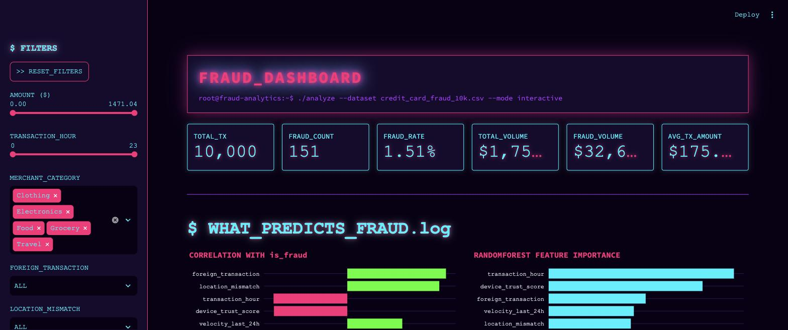
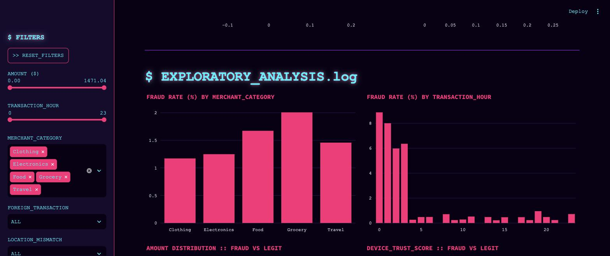
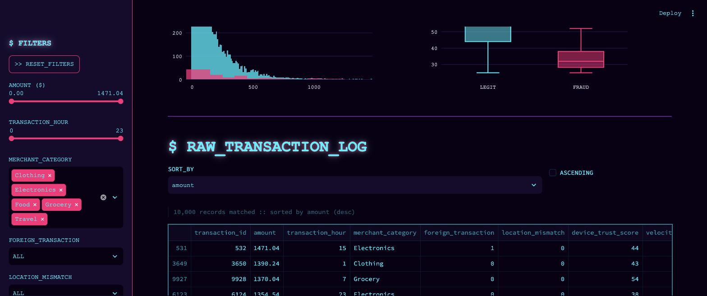

# FRAUD_DASHBOARD.exe

A Streamlit dashboard for exploring `credit_card_fraud_10k.csv`, styled with a neon cyberpunk color scheme (deep-purple/black background, hot-pink, cyan, and neon-green glow accents on a monospace terminal aesthetic). Filter and sort 10,000 transactions and see which features are most predictive of fraud.

## Screenshots

**Overview + predictive features**
Correlation and RandomForest feature-importance charts rank which columns predict `is_fraud`.



**Exploratory analysis**
Fraud rate by merchant category and hour, amount distribution, and device trust score comparisons (fraud vs. legit).



**Raw transaction log**
Sortable, filterable data table with CSV export.



## Features

- **Sidebar filters**: amount, transaction hour, merchant category, foreign transaction, location mismatch, device trust score, velocity (last 24h), cardholder age, and fraud status — with a one-click reset.
- **KPI tiles**: total transactions, fraud count, fraud rate, total volume, fraud volume, average transaction amount — all react to the active filters.
- **Feature predictiveness**: a correlation-with-`is_fraud` chart and a RandomForest `feature_importances_` chart, computed live on the filtered data.
- **Exploratory charts**: fraud rate by merchant category and by hour, amount distribution (fraud vs. legit), device trust score distribution (fraud vs. legit).
- **Sortable data table**: pick any column and sort direction, with a filtered-CSV download button.

## Running locally

```bash
pip install -r requirements.txt
streamlit run app.py
```

Then open the URL Streamlit prints (defaults to `http://localhost:8501`).
